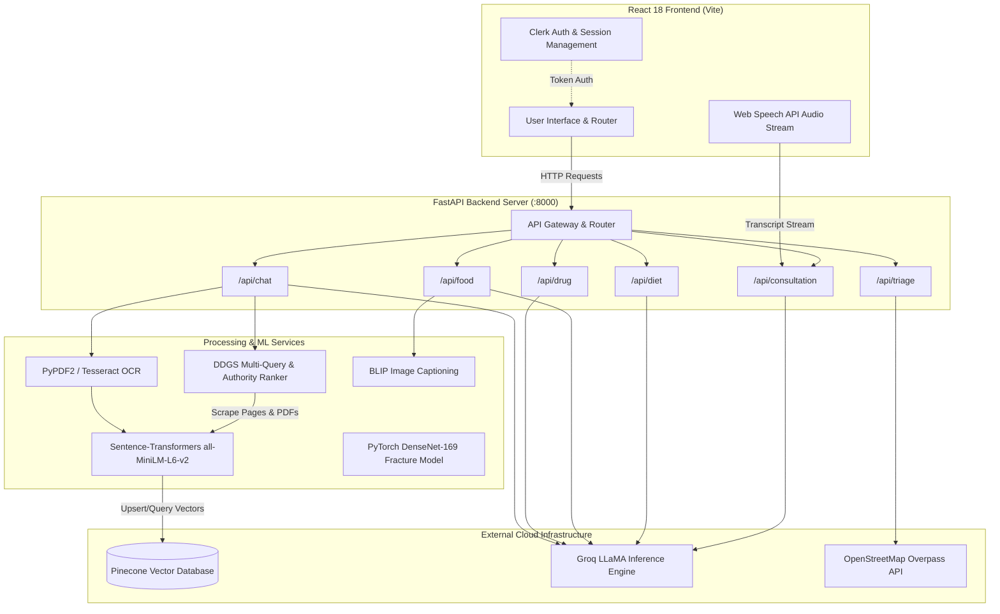
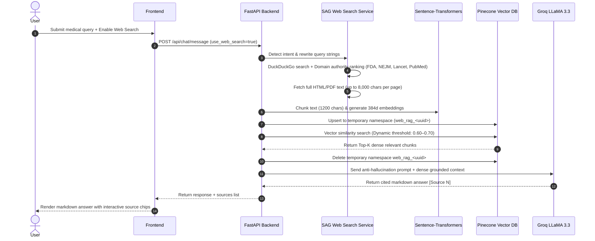
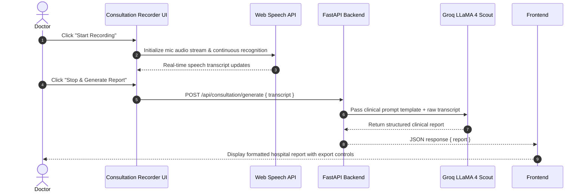

# 🩺 MedAI — Next-Generation AI Healthcare Ecosystem

[](https://www.python.org/)
[](https://fastapi.tiangolo.com/)
[](https://reactjs.org/)
[](https://vitejs.dev/)
[](https://groq.com/)
[](https://www.pinecone.io/)
[](https://pytorch.org/)
[](https://clerk.com/)

**MedAI** is an enterprise-grade, full-stack artificial intelligence platform designed for medical research, automated clinical documentation, real-time emergency triage, pharmacology risk analysis, nutritional safety assessment, and computer vision diagnostic modeling.

Combining **Search-Augmented Generation (SAG)**, **Document RAG**, **Multimodal Vision**, **Web Speech Audio Processing**, **PyTorch Deep Learning Models**, and **OpenStreetMap Geolocation Integration**, MedAI bridges the gap between patient care and clinical-grade AI assistance.

---

## 🌟 Key Modules & Feature Overview

### 1. 🤖 MedAI Web-RAG & Document Research Assistant
* **Live Internet Web-RAG (SAG Pipeline)**: Executes intent-aware queries (`CLINICAL_TRIAL`, `FDA_APPROVAL`, `GENERAL`) over real-time web sources (FDA, ASCO, NEJM, The Lancet, PubMed, NIH).
* **Document Ingestion Engine**: Dynamically parses PDFs, scanned images (via Tesseract OCR), and text files. Chunks documents and embeds them locally into a vector store.
* **Ephemeral Pinecone Vector Search**: Chunks scraped web pages and uploaded files, generates 384-dimensional dense embeddings (`sentence-transformers/all-MiniLM-L6-v2`), upserts into isolated session namespaces (`web_rag_*`), and retrieves top semantic matches before deleting the temporary namespace.
* **Strict Numerical & Grounding Verification**: Enforces verbatim accuracy for clinical trial metrics (OS, PFS, ORR, Hazard Ratios) with mandatory inline source citations (`[Source N]`).

### 2. 🎙️ Consultation Report Generator
* **Voice-to-Clinical Report Pipeline**: Leverages the browser **Web Speech API** for live doctor-patient conversation speech-to-text recording with real-time transcript streaming.
* **LLM Clinical Transformer**: Processes transcripts through Groq's high-capacity LLM models (`llama-4-scout-17b-16e-instruct` / `llama-3.3-70b-versatile`) to generate formal, hospital-grade consultation reports containing:
  - *Patient Demographics, Chief Complaint, HPI, Past Medical History, Extracted Symptoms, Clinical Observations, Diagnosis, Prescriptions, Lifestyle Advice, Key Highlights, and Follow-up Plans.*

### 3. 🏥 Emergency Medical Triage & Geolocation Hospital Finder
* **Risk Level Classifier**: Evaluates symptoms, onset duration, age, gender, pre-existing conditions, and attached medical reports to output risk levels: **EMERGENCY 🔴**, **URGENT 🟡**, or **SAFE 🟢**.
* **Actionable Do's & Don'ts**: Provides 5–6 points of structured emergency guidance and home care precautions.
* **Real-Time Nearby Hospital Lookup**: Queries OpenStreetMap's Overpass API (`overpass-api.de`) within a 5 km radius of the user's GPS coordinates to find operating hospitals and clinics with phone numbers.

### 4. 💊 Multimodal Drug Interaction & Safety Checker
* **Multimodal Prescription Analysis**: Visually inspects pill bottles and prescription sheets using `llama-3.2-90b-vision-preview` or evaluates typed drug lists with `llama-3.3-70b-versatile`.
* **Fatal Contraindication Alerts**: Dynamically detects severe drug-drug interactions and allergen conflicts, outputting explicit warnings (e.g., *"Don't Consume These Two: Aspirin, Warfarin"*).
* **Pharmacological Insights**: Detailed breakdown of mechanism of action, common side effects, and risk rationale.

### 5. 🥗 AI Food Safety & Glycemic Load Analyzer
* **Local Vision Captioning**: Uses HuggingFace Transformers (`Salesforce/blip-image-captioning-base`) locally to analyze food images.
* **Net Glycemic Load Evaluation**: Evaluates fiber and protein content alongside carbohydrates (e.g., recommending high-protein/low-GI lentils for diabetic patients over refined carbs).
* **Decile Safety Score (0–10)**: Provides precise decimal ratings, macronutrient distribution percentages (Carbs %, Protein %, Fats %), physiological risk breakdowns, and healthier recipe alternatives.

### 6. 🍎 Personalized Diet Plan Generator
* **Clinical Nutrition Engine**: Generates targeted 4-meal daily schedules (Breakfast, Lunch, Dinner, Snacks) and daily caloric targets tailored to specific diseases (Diabetes, Hypertension, Heart Disease, Arthritis).
* **Post-Processing Allergen Filter**: Programmatically strips potential allergen keywords from generated meals to guarantee absolute safety.

### 7. ⚡ AI Input Autocomplete API (`/api/food/suggest`)
* Fast JSON-mode autocomplete endpoint suggesting diseases, symptoms, foods, or allergies based on partial user input.

### 8. 🧠 PyTorch Deep Learning & Computer Vision
* **DenseNet-169 Bone Fracture Classifier**: Fine-tuned PyTorch architecture (`models/fracture_densenet.pth`) trained on bone X-rays with data augmentation, weighted random sampling, cosine annealing LR scheduler, and evaluation scripts (`calculate_f1.py`, `test_accuracy.py`).
* **CheXNet Chest X-Ray Benchmark**: Evaluation script (`test_nih_accuracy.py`) measuring model performance across 14 official NIH ChestX-ray pathology classes.

---

## 🏗️ System Architecture



---

## 🔄 Working Pipelines

### 1. Ephemeral Web-RAG (Search-Augmented Generation) Pipeline



---

### 2. Speech-to-Consultation Report Pipeline



---

## 🛠️ Technology Stack

| Domain | Component | Technology / Library |
| :--- | :--- | :--- |
| **Frontend** | Framework | React 18 (Vite build tool) |
| | Authentication | Clerk (`@clerk/clerk-react`) |
| | Routing & Icons | React Router DOM v6, SVG Icon System |
| | Styling | Vanilla CSS Design System, Glassmorphism, Google Fonts |
| | Voice Input | Web Speech API (`SpeechRecognition`) |
| **Backend** | API Framework | Python 3.10+, FastAPI, Uvicorn |
| | Document Parsing | PyPDF2 (PDFs), Tesseract OCR / `pytesseract` (Images) |
| | HTTP Client | `httpx`, `requests` |
| **AI & ML** | LLM Inference | Groq API (`llama3-8b-8192`, `llama-3.3-70b-versatile`, `llama-3.2-90b-vision-preview`, `llama-4-scout-17b-16e-instruct`) |
| | Vector Database | Pinecone (Serverless) |
| | Text Embeddings | `sentence-transformers/all-MiniLM-L6-v2` (384-dim) |
| | Web Retrieval | DuckDuckGo Search (`ddgs`) |
| | Local Vision | HuggingFace Transformers (`Salesforce/blip-image-captioning-base`) |
| | PyTorch Model | `torchvision.models.densenet169` (Fine-tuned for bone fracture) |
| **GIS & Geolocation**| Maps Data | OpenStreetMap Overpass API (`overpass-api.de`) |

---

## 📁 Repository Structure

```
medai-ai-medical/
├── backend/
│   ├── main.py                     # FastAPI application entry point & router registrations
│   ├── config.py                   # Pydantic environment configurations & settings
│   ├── requirements.txt            # Python dependencies
│   ├── vercel.json                 # Vercel deployment configuration
│   ├── finetune_densenet.py        # PyTorch DenseNet-169 fine-tuning pipeline
│   ├── train_fracture.py           # Training script for bone fracture detection
│   ├── calculate_f1.py             # Evaluation script for classification metrics & F1-score
│   ├── test_accuracy.py            # Test set accuracy validation script
│   ├── test_nih_accuracy.py        # NIH ChestX-ray 14-class benchmark evaluation
│   ├── models/                     # Saved PyTorch model checkpoints (.pth) & results
│   ├── routes/
│   │   ├── chat.py                 # Document RAG & Web-RAG endpoints
│   │   ├── triage.py               # Medical triage assessment & hospital lookup
│   │   ├── diet.py                 # Personal diet plan generator endpoint
│   │   ├── food.py                 # Food safety analyzer & AI autocomplete endpoints
│   │   ├── drug.py                 # Multimodal drug interaction endpoints
│   │   └── consultation.py         # Speech consultation report endpoint
│   ├── services/
│   │   ├── groq_service.py         # Groq LLM API integrations & RAG prompt builders
│   │   ├── pinecone_service.py     # Vector upsert, similarity search, & namespace management
│   │   ├── embedding_service.py    # Local Sentence-Transformers dense embedding engine
│   │   ├── rag_service.py          # Document RAG pipeline manager
│   │   ├── web_search_service.py   # Multi-query DDG search & authority ranker (SAG v3)
│   │   ├── web_rag_service.py      # Ephemeral Pinecone Web-RAG chunking & filtering
│   │   ├── triage_service.py       # Triage risk logic & actionable guidelines engine
│   │   ├── consultation_service.py # Audio transcript to clinical report transformer
│   │   ├── diet_service.py         # Rule-based & LLM nutritionist engine
│   │   ├── drug_service.py         # Multi-modal vision & drug safety evaluator
│   │   └── food_service.py         # BLIP image captioning & glycemic safety evaluator
│   └── utils/
│       ├── document_parser.py      # PDF & OCR file extraction utilities
│       └── chunker.py              # Recursive text splitting utilities
├── frontend-2/
│   ├── package.json                # Frontend Node.js dependencies
│   ├── vite.config.js              # Vite configuration
│   ├── index.html                  # HTML template with Google Fonts
│   └── src/
│       ├── App.jsx                 # React main application layout, Clerk auth wrapper & routes
│       ├── main.jsx                # Application root entry point
│       ├── index.css               # Design system & CSS glassmorphism rules
│       ├── pages/
│       │   ├── Home.jsx            # Landing page with interactive hero section
│       │   ├── Chat.jsx            # Web-RAG & Document RAG assistant page
│       │   ├── DoctorCheck.jsx     # Triage checker & nearby hospital finder page
│       │   ├── ConsultationReport.jsx # Consultation report management page
│       │   ├── DrugChecker.jsx     # Drug interaction safety checker page
│       │   ├── FoodSafety.jsx      # Food safety & nutrition evaluation page
│       │   └── Diet.jsx            # Personalized diet plan builder page
│       ├── components/
│       │   ├── Sidebar.jsx         # Collapsible main navigation sidebar
│       │   ├── ConsultationRecorder.jsx # Live Web Speech audio recorder modal
│       │   ├── Chat/               # Chat bubbles, input box, and session history components
│       │   └── Forms/              # Autocomplete input fields & feature form components
│       └── services/
│           └── api.jsx             # Unified HTTP client for backend endpoints
└── README.md                       # Repository documentation
```

---

## ⚙️ Installation & Local Setup

### Prerequisites
- **Python**: `3.10` or higher
- **Node.js**: `18.x` or higher & `npm`
- **Tesseract OCR**: Required for image OCR processing.
  - *Ubuntu/Debian*: `sudo apt-get install tesseract-ocr`
  - *macOS*: `brew install tesseract`
  - *Windows*: Install executable from [UB-Mannheim Tesseract Wiki](https://github.com/UB-Mannheim/tesseract/wiki).

---

### 1. Backend Setup

```bash
# Navigate to backend directory
cd backend

# Create virtual environment
python -m venv venv

# Activate virtual environment
# On Linux/macOS:
source venv/bin/activate
# On Windows:
venv\Scripts\activate

# Install Python dependencies
pip install -r requirements.txt

# Create environment configuration file
cp .env.example .env
```

#### Configure Backend `.env` File
Create or update `backend/.env` with your API credentials:
```env
GROQ_API_KEY=your_groq_api_key_here
PINECONE_API_KEY=your_pinecone_api_key_here
PINECONE_INDEX_NAME=medai-rag
PINECONE_CLOUD=aws
PINECONE_REGION=us-east-1
EMBEDDING_MODEL=all-MiniLM-L6-v2
EMBEDDING_DIMENSION=384
```

> **API Key Resources:**
> - Groq API Key: [console.groq.com](https://console.groq.com/keys)
> - Pinecone API Key: [app.pinecone.io](https://app.pinecone.io/)

#### Launch Backend Server
```bash
python main.py
# Backend runs at http://localhost:8000
# Interactive API documentation (Swagger UI): http://localhost:8000/docs
```

---

### 2. Frontend Setup

```bash
# Navigate to frontend directory
cd frontend-2

# Install dependencies
npm install

# Create environment configuration file
cp .env.example .env
```

#### Configure Frontend `.env` File
Create or update `frontend-2/.env`:
```env
VITE_API_URL=http://localhost:8000
VITE_CLERK_PUBLISHABLE_KEY=your_clerk_publishable_key_here
```

#### Launch Frontend Development Server
```bash
npm run dev
# Frontend runs at http://localhost:5173
```

---

## 📡 REST API Reference

| Endpoint | Method | Request Payload | Description |
| :--- | :--- | :--- | :--- |
| **`/health`** | `GET` | None | Returns API health status. |
| **`/api/chat/upload`** | `POST` | `multipart/form-data` (`file`) | Ingests PDF/Image document into RAG vector store; returns `session_id`. |
| **`/api/chat/message`** | `POST` | `application/json` (`message`, `session_id`, `history`, `use_web_search`) | Generates answer via Document RAG, Ephemeral Web-RAG, or general LLM. |
| **`/api/triage/assess`** | `POST` | `multipart/form-data` (`symptoms`, `duration`, `age`, `gender`, `diseases`, `file`) | Evaluates medical risk (`EMERGENCY`, `URGENT`, `SAFE`) & guidelines. |
| **`/api/triage/hospitals`** | `GET` | Query Params (`lat`, `lng`) | Returns nearby hospitals/clinics within 5km via OpenStreetMap Overpass API. |
| **`/api/consultation/generate`** | `POST` | `application/json` (`transcript`) | Transforms raw doctor-patient speech transcript into structured clinical report. |
| **`/api/drug/interactions`** | `POST` | `multipart/form-data` (`drugs`, `allergies`, `drug_image`, `med_report`) | Evaluates multi-drug interactions & fatal contraindications visually or via text. |
| **`/api/food/safety`** | `POST` | `multipart/form-data` (`food_text`, `disease`, `symptoms`, `allergies`, `food_image`, `med_report`) | Assesses food safety rating (0-10), glycemic load, risks, and alternatives. |
| **`/api/food/suggest`** | `POST` | `application/json` (`field_type`, `partial_text`) | AI-driven JSON autocomplete for UI inputs. |
| **`/api/diet/generate`** | `POST` | `multipart/form-data` (`disease`, `symptoms`, `allergies`, `file`) | Generates personalized daily 4-meal diet plan & macro percentages. |

---

## 🔬 PyTorch Computer Vision Subsystem

MedAI includes deep learning scripts for medical image classification:

```bash
# Fine-tune DenseNet-169 on bone fracture dataset
python backend/finetune_densenet.py

# Evaluate test accuracy of saved checkpoint
python backend/test_accuracy.py

# Calculate precision, recall, and weighted F1-score
python backend/calculate_f1.py

# Benchmark CheXNet vision model against NIH ChestX-ray 14 dataset
python backend/test_nih_accuracy.py --zip-file /path/to/images.zip --csv-file /path/to/Data_Entry_2017.csv
```

---

## 🛡️ Medical Disclaimer & Safety Notice

> **IMPORTANT**: MedAI is an artificial intelligence research platform designed to assist healthcare professionals and support medical research. **MedAI is not a licensed medical practitioner and does not provide formal medical diagnoses or prescriptions.** Users should always consult qualified healthcare professionals for medical advice, diagnosis, or treatment decisions. In case of a medical emergency, contact your local emergency services immediately.

---

## 📄 License

Distributed under the MIT License. See `LICENSE` for more details.
